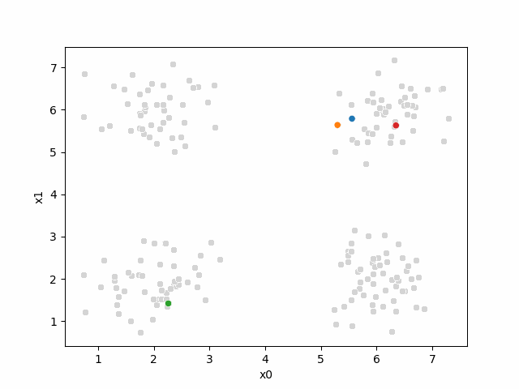
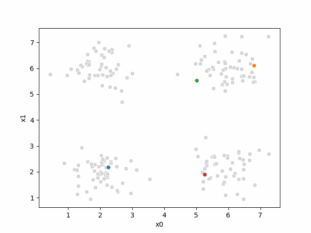
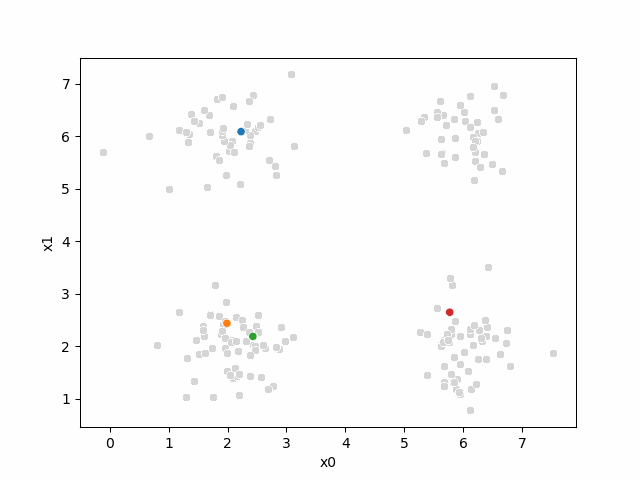
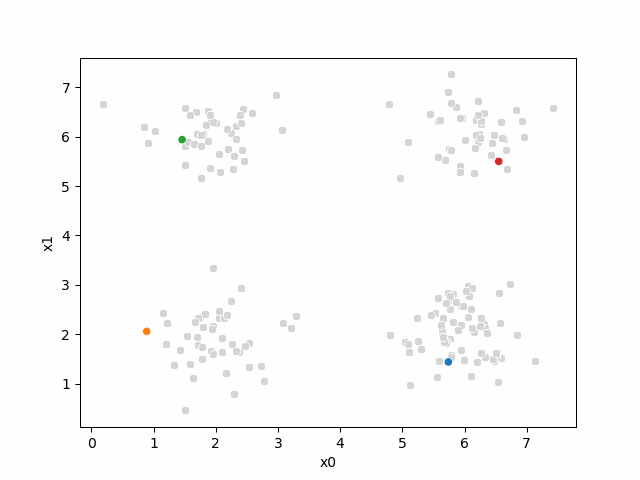
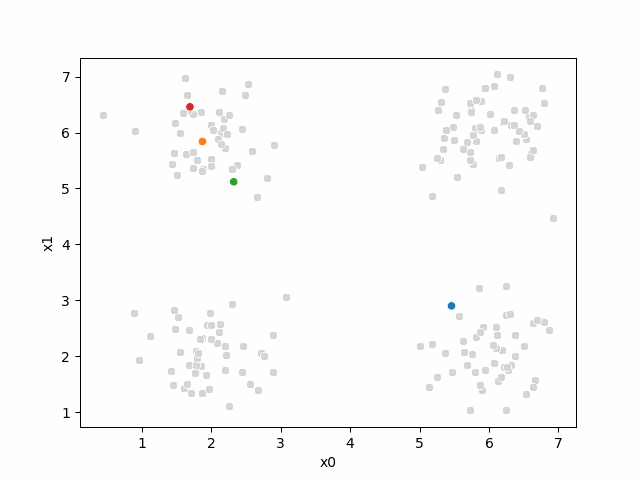

---
jupytext:
  text_representation:
    extension: .md
    format_name: myst
    format_version: 0.13
    jupytext_version: 1.17.3
kernelspec:
  display_name: Python 3 (ipykernel)
  language: python
  name: python3
---

# KMmeans algorithm

Computationally, this is a harder problem.  Mathematically, we can
typically solve problems when we have a number of equations equal to or greater
than the number of unknowns.  For $N$ data points ind $d$ dimensions and $K$ clusters, we have $N$
equations and $N + K*d$ unknowns. This means we have a harder problem to solve.

Clustering is a stochastic (random) algorithm, so it can be a little harder to debug the models and measure performance.  For this reason, we are going to look a little more closely at what it actually *does* than we did with classification.

```{code-cell} ipython3
import matplotlib.pyplot as plt
import numpy as np
import itertools
import seaborn as sns
import pandas as pd
from sklearn import datasets
from sklearn.cluster import KMeans
from sklearn import metrics
import string
import itertools as it
import imageio.v3 as iio # for making gifs to save

# set global random seed so that the notes are the same each time the site builds
rand_seed =398

np.random.seed(rand_seed)
```
<!-- #seeds for gifs: 103,1107,238,1089 -->

## How does Kmeans work?
+++
We will start with some synthetic data and then see how the clustering works.  This data is set so that the algorithm works well for sure and is unlikely to get stuck. 

+++
This code should be fairly readable, but is not strictly required.
One tricky part is [`zip`](https://docs.python.org/3.9/library/functions.html#zip) which is a builtin fuction for iteratinv over groups of things together.

And [`itertools`](https://docs.python.org/3/library/itertools.html) is a core library for related more iterating.
+++


One way to understand this block of code is to try changing the parameters (the top section) and see how they effect the plots.  The `var` and `spacing` will have the most impact on the clustering performance. 

```{code-cell} ipython3
# ------ Set paramters, change these to adjust the sample
# number of classes (groups)
C = 4
# number of dimensions of the features
D=2
# number of samples
N = 200
# minimum of the means
offset = 2
# distance between means
spacing = 2
# set the variance of the blobs
var = .25

# ------ Get the class labels
# choose the first C uppcase letters using the builtin string class
classes = list(string.ascii_uppercase[:C])

# ----- Pick some means
# get the number of grid locations needed
G = int(np.ceil(np.sqrt(C)))

# get the locations for each axis
grid_locs = a = np.linspace(offset,offset+G*spacing,G)

# compute grid (i,j) for each combination of values above & keep C values
means = [(i,j) for i, j in it.product(grid_locs,grid_locs)][:C]

# store in dictionary with class labels
mu = {c: i for c, i in zip(classes,means)}


# ----- Sample the data
#randomly choose a class for each point, with equal probability
clusters_true = np.random.choice(classes,N)
# draw a random point according to the means from above for each point
data = [np.random.multivariate_normal(mu[c], var*np.eye(D)) for c in clusters_true]

# ----- Store in a dataframe
# rounding to make display neater later
df = pd.DataFrame(data = data,columns = ['x' + str(i) for i in range(D)]).round(2)

# add true cluster
df['true_cluster'] = clusters_true
```

This gives us a small dataframe with {eval}`D` features and {eval}`C` clusters[^hovereval].

[^hovereval]: the numbers in this sentence are inserted with code so you can hover to see what variables they came from. 


```{code-cell} ipython3
:label: originaldf
df.head()
```

We can see the data two different ways: 

::::::{tab-set}
:::{tab} labeled


```{code-cell} ipython3
:label: labeledgenerated
sns.scatterplot(data =df,x='x0',y='x1',hue='true_cluster')
```

:::
:::{tab} How Kmeans 'sees' it
```{code-cell} ipython3
:label: init
sns.scatterplot(data =df,x='x0',y='x1',color='lightgray',legend=False)
```
:::
::::::::::

It's all the same points, but Kmeans does not get the `true_cluster` column.  We used that to *generate* the data, but it is not used by the KMeans algorithm. 

## Setup

+++
First we will make a variable that we can use to pick out the feature columns

```{code-cell} ipython3
data_cols = ['x0','x1']
```


Next, we'll set up some helper code.

:::::{margin}
::::{attention}
I moved the order of some things while cleaning things up today
::::
:::::::

For more on [color palettes](https://seaborn.pydata.org/generated/seaborn.color_palette.html) see the seaborn docs
+++


```{code-cell} ipython3
:label: dfhelper
def mu_to_df(mu,i):
    '''
    take a numpy array and make a small df with columns for the features, class label and a type column so it can be combined with other data later
    '''
    mu_df = pd.DataFrame(mu,columns=['x0','x1'])
    mu_df['iteration'] = str(i)
    mu_df['class'] = ['M'+str(i) for i in range(K)]
    mu_df['type'] = 'mu'
    return mu_df
```

We want to make plots with the data and the means visible. I would like to have the points in pale colors and the means in bold.  

You can see that the seaborn `tab20` pallete is paired colors:

```{code-cell} ipython3
sns.color_palette('tab20',8)
```

The `cmap_pt` and `cmap_mu` takes the odd and even subsets of the palette into two separate palettes. 

```{code-cell} ipython3
cmap_pt = sns.color_palette('tab20',8)[1::2]
cmap_mu = sns.color_palette('tab20',8)[0::2]
```

Remember the third number in an iterator is the step, so we can take every nth element from an {term}`iterable` like: {eval}`list(range(10))[::2]` or {eval}`list(range(10))[1::2]`


## Initializing the algorithm

Kmeans starts by setting `K`, we will use {eval}`C` to match the correct valued for our data. 
```{code-cell} ipython3
K =C
```

We could set this differently, but our firs time through we want to see it work well

::::{exercise} Explore this algorithm
:class: dropdown

Try changing this number manually and seeing how things change to understand better. 

You can download this file as a myst notebook from the download icon at the top of the page and if you have jupytext you can right click on the file then select "Notebook" from "Open with"


:::::


This is an {term}`iterative` algorithm, so we will initialize a counter variable so we can track how many times it goes through its steps. 
```{code-cell} ipython3
i =0
```

The last part of the initialization is to select {eval}`K` points to be our initial means[^hovereval]: 


```{code-cell} ipython3
mu0 = df[data_cols].sample(n=K).values
mu0
```

Now,  we will use our [helper function](#dfhelper) to make them easier to read and label them for later use:

```{code-cell} ipython3
mu_df = mu_to_df(mu0,i)
mu_df
```

And visualize, by updating our plot: 
```{code-cell} ipython3
:label: kminit
sfig = sns.scatterplot(data =df,x='x0',y='x1',color='lightgray',legend=False)
# plt.plot(mu[:,0],mu[:,1],marker='s',linewidth=0)
mu_df = mu_to_df(mu0,i)
sns.scatterplot(data =mu_df,x='x0',y='x1',hue='class',palette=cmap_mu,ax=sfig,legend=False)
```

```{code-cell} ipython3
:tags: [remove-input]
# save the figure for later use:
sfig.get_figure().savefig('kmeans00.png')
```

At this piont, we have all the points, but no labels for them, and we have these {eval}`K` points as our means. 

(kmassignment)=
## Assignment step

Now, we will compute, for each sample, which of those {eval}`K` points it is closest to
first by taking the difference, squaring it, then summing along each row.

To compute the distance we will first subtract from the mean:
```{code-cell} ipython3
(df[data_cols].loc[0]- mu0[0])
```

then square each
```{code-cell} ipython3
((df[data_cols].loc[0]- mu0[0])**2)
```

and sum
```{code-cell} ipython3
((df[data_cols].loc[0]- mu0[0])**2).sum()
```

If we needed the right units on these distances, we would also `sqrt` but, we actually will just use the distances to figure out which mean is closes to the each point.  If $a > b > c$ then $\sqrt{a} > \sqrt{b} > \sqrt{c}$ so we do not need the sqrt to get the right end answer so we can save that step, which saves computation. 

we can do this fo all of the rows

```{code-cell} ipython3
((df[data_cols]- mu0[0])**2).sum(axis=1)
```

then we can do this for all four means:

```{code-cell} ipython3
[((df[data_cols]- mu_i)**2).sum(axis=1) for mu_i in mu0]
```

This gives us a list of {eval}`K` data DataFrames, one for each mean ({eval}`mu0`), with one row
for each point in the dataset with the distance from that point to the
corresponding mean. We can concatenate these horizontally (`axis=1`) these into one DataFrame. 
::::::{attention}
If you could not run this part in class, jump down to the [solution](#ufunc-error) and then come back
:::::::::

```{code-cell} ipython3
:label: listsubtract
pd.concat([((df[data_cols]- mu_i)**2).sum(axis=1) for mu_i in mu0],axis=1).head()
```

Now we have one row per sample and one column per mean, with with the distance from that point to the mean. What we want is to calculate the assignment, which
mean is closest, for each point.  Using `idxmin` with `axis=1` we take the
minimum across each row and returns the index (location) of that minimum.

```{code-cell} ipython3
pd.concat([((df[data_cols]- mu_i)**2).sum(axis=1) for mu_i in mu0],axis=1).idxmin(axis=1)
```
We'll save all of this in a column named `'0'`. Since it is our 0th iteration.
+++
This is called the **assignment** step.

```{code-cell} ipython3
:label: kmassignment0
df[str(i)] = pd.concat([((df[data_cols]- mu_i)**2).sum(axis=1) for mu_i in mu0],axis=1).idxmin(axis=1)
```
to see what we have:
```{code-cell} ipython3
df.head()
```

andd now we can re-plot, we still have the same means, but now we use the `'0'` column to give the points each a color. 

Now we can plot the data, save the axis, and plot the means on top of that.
Seaborn plotting functions return an axis, by saving that to a variable, we
can pass it to the `ax` parameter of another plotting function so that both
plotting functions go on the same figure. 


```{code-cell} ipython3
sfig = sns.scatterplot(data =df,x='x0',y='x1',hue='0',palette=cmap_pt,legend=False)
# plt.plot(mu[:,0],mu[:,1],marker='s',linewidth=0)
mu_df = mu_to_df(mu0,i)
sns.scatterplot(data =mu_df,x='x0',y='x1',hue='class',palette=cmap_mu,
                ax=sfig,legend=False)
```

::::{margin}
:::{tip}
this strategy of saving the plot axes to add an additional plot
is a common way to make more complicated plots, something you might use in your extensions
:::
::::

```{code-cell} ipython3
:tags: [remove-input]
sfig.get_figure().savefig('kmeans01.png')
```


+++
We see that each point is assigned to the lighter shade of its matching mean.
These points are the one that is closest to each point, but they're not the
centers of the point clouds.
Now, we can compute new means of the points assigned to each cluster, using
groupby.

## Updating the means

```{code-cell} ipython3
mu1 = df.groupby('0')[data_cols].mean().values
```
We can plot these again, the same data, but with the new means.

```{code-cell} ipython3
fig = plt.figure()
mu_df = mu_to_df(mu1,1)
sfig = sns.scatterplot(data =df,x='x0',y='x1',hue='0',palette=cmap_pt,legend=False)
sns.scatterplot(data =mu_df,x='x0',y='x1',hue='class',palette=cmap_mu,ax=sfig,legend=False)

sfig.get_figure().savefig('kmeans02.png')
```

We see that now the means are in the center of each cluster, but that there are
now points in one color that are assigned to other clusters.
+++
So, again we can update the assignments.

```{code-cell} ipython3
i=1 #increment 
df[str(i)] = pd.concat([((df[data_cols]-mu_i)**2).sum(axis=1) for mu_i in mu1],axis=1).idxmin(axis=1)
df.head()
```
And plot again:
```{code-cell} ipython3
sfig = sns.scatterplot(data =df,x='x0',y='x1',hue=str(i),palette=cmap_pt,legend=False)
# plt.plot(mu[:,0],mu[:,1],marker='s',linewidth=0)
mu_df = mu_to_df(mu1,i)
sns.scatterplot(data =mu_df,x='x0',y='x1',hue='class',palette=cmap_mu,ax=sfig,legend=False)
sfig.get_figure().savefig('kmeans03.png')
```

we see it improves by the means moved to the center of each color. 

+++

## Iterating to completion

If we keep going back and forth like this, eventually, the assignment step will
not change any assignments. We call this condition convergence. We can
implement the algorithm with a while loop.

We will set the {term}`stopping criterion` to be 0 changed assignments. 

```{code-cell} ipython3
mu_list = [mu_to_df(mu0,0),mu_to_df(mu1,1)]
cur_old = str(i-1)
cur_new = str(i)
curmu = mu1
number_changed_assignments = sum(df[cur_old] !=df[cur_new])
while number_changed_assignments >0:
    cur_old = cur_new
    i +=1
    cur_new = str(i)
    #     update the means and plot with current generating assignments
    curmu = df.groupby(cur_old)[data_cols].mean().values
    mu_df = mu_to_df(curmu,i)
    mu_list.append(mu_df)

    fig = plt.figure()
    # plot with old assignments
    sfig = sns.scatterplot(data =df,x='x0',y='x1',hue=cur_old,palette=cmap_pt,legend=False)
    sns.scatterplot(data =mu_df,x='x0',y='x1',hue='class',palette=cmap_mu,ax=sfig,legend=False)
    #  save image to combine into a gif for the notes (do not need to do this)
    file_num = str(i*2 ).zfill(2)
    sfig.get_figure().savefig('kmeans' +file_num + '.png')
    
    
    #     update the assigments and plot with the associated means
    df[cur_new] = pd.concat([((df[data_cols]-mu_i)**2).sum(axis=1) for mu_i in curmu],axis=1).idxmin(axis=1)
    
    
    fig = plt.figure()
    sfig = sns.scatterplot(data =df,x='x0',y='x1',hue=cur_new,palette=cmap_pt,legend=False)
    sns.scatterplot(data =mu_df,x='x0',y='x1',hue='class',palette=cmap_mu,ax=sfig,legend=False)
    #  save image to combine into a gif for the notes (do not need to do this)
    # we are making 2 images per iteration
    file_num = str(i*2+1).zfill(2)
    sfig.get_figure().savefig('kmeans' +file_num + '.png')
    number_changed_assignments = sum(df[cur_old] !=df[cur_new])
    print( 'iteration ' + str(i))
    
```

### animated 
```{code-cell} ipython3
:tags: ["hide-cell"]
# make a gif to load
# write the file names
img_files = ['kmeans' + str(ii).zfill(2) +'.png' for ii in range(i*2+1)]
#  load the imges back
images = np.stack([iio.imread(img_file) for img_file in img_files],axis=0)
# write as  gif
iio.imwrite('kmeans'+str(rand_seed) + '.gif', images,loop=0,duration=1000,plugin='pillow')  # Adjust duration as needed
```




Here are some other runs that I saved. I updated this notebook so that it saved the final gif as a different name based on the random seed, ran it a few times with different seeds then kept one I thought was a good visualization above. 









Including this on were it got stuck:




### storyboard
We can also make them a grid:

```{code-cell} ipython3
df_vis = df.melt(id_vars = ['x0','x1'], var_name ='iteration',value_name='class')
df_vis.replace({'class':{i:c for i,c in enumerate(string.ascii_uppercase[:C])}},inplace=True)

df_vis['type'] = 'pt'
df_mu_vis = pd.concat([pd.concat(mu_list),df_vis])
cmap = sns.color_palette('tab20',8)
n_iter = i

sfig = sns.relplot(data=df_mu_vis,x='x0',y='x1',hue='class',col='iteration',
            col_wrap=3,hue_order = ['M0','A','M1','B','M2','C','M3','D'],
           palette = cmap,size='type',col_order=[str(i) for i in range(n_iter+1)])
```

```{code-cell} ipython3

```
## More metrics

We'll go back to the iris data
```{code-cell} ipython3
iris_df =sns.load_dataset('iris')
sns.pairplot(iris_df)
```
first let's cluster it again:

```{code-cell} ipython3
measurement_cols = ['sepal_length','petal_length','sepal_width','petal_width']
iris_X = iris_df[measurement_cols]
```

we'll create our object
```{code-cell} ipython3
km3 = KMeans(n_clusters=3)
```

and save the predictions
```{code-cell} ipython3
y_pred = km3.fit_predict(iris_X)
y_pred[:5]
```

:::{important}
In class, we ran the algorithm a few times and saw that the number changed
:::


We saw the silhouette score last class, which is a true clustering method, so we can use that to see if a clustring algorithm has succeeded on in a real use case where we actually do not have the labels. 
However if we were checkinng if our implementation of a clustering algorithm worked or if our new clustering algorithm worked, we would test with the actual labels that we do have to know if the algorithm found the same groups we had.  We might also want to in a real clustering context see if two different runs of a clustering algorithm were the same, or if two different algorithms on the same data found the same solution.  In this case we can use other metrics, like mutual information. 

Mutual information measures how much knowing one variable tells about another. It can be interpretted like a correlation for categorical variables. 
```{code-cell} ipython3
metrics.adjusted_mutual_info_score(iris_df['species'],y_pred)
```
This score is pretty good, but not perfect, but the classification with the labels was not either so that makes sense


A variable has 1 AMI with itself:


```{code-cell} ipython3
metrics.adjusted_mutual_info_score(iris_df['species'],iris_df['species'])
```

and uncorrelated thing have AMI near 0

```{code-cell} ipython3
metrics.adjusted_mutual_info_score(np.random.choice(4,size=100),
                                   np.random.choice(4,size=100))
```

```{code-cell} ipython3

```

(ufunc)=
## Ufunc error


A few of you had an error in class.  I was able to replicate it! (and thanks to the student who emailed about what they learned)

```{code-cell} ipython3
:tags: raises-exception
[df[data_cols] - mui for mui in mu]
```

This is because I changed from overwriting the variable `mu` which is a {eval}`type(mu)` to using using new variables, `mu0` and `mu1` which are {eval}`type(mu0)` 

recall the initial `mu` is the set up for generating data: 
```{code-cell} ipython3
mu
```

if {term}`iterate` over a {eval}`type(mu)` then 
we get the **keys** (here the class labels) instead of the **values** (here the true means)

```{code-cell} ipython3
[mui for mui in mu]
```

We cannot subtract characters from floats, so it gave an error. 

:::::::{warning}
At least one person used AI for an answer, which makes the code run, but is wrong, conceptually. 

The correct solution is to use `mu0` instead of `mu`.  If you use `mu.values`, then you subtract the **true** means used to generate the data instead of the ones that had been computed. 
::::::::::

It is a `UfuncTypeError` because in `numpy` the [universal functions (`ufunc`)](https://numpy.org/doc/stable/reference/ufuncs.html) are used for functions that operate element wise on numpy arrays (which is what we were doing with the subtraction). 

This tells us that the way python parses the [subtraction](#listsubtract) in this case is to extract the values from the `pd.DataFrame` to get two `np.ndarray` and use the `numpy` subtract function. 

:::{note}
Even operators like `-`, `+`, `<` etc are implemented as methods of object classes, so if in Python, you are creating your own objects you can add a special method to the objec to be able to use operators with your objects
:::: 

## Questions


```{code-cell} ipython3
df.dtypes
```

```{code-cell} ipython3
conda env update --name rhodyds --file https://raw.githubusercontent.com/rhodyprog4ds/BrownFall25/refs/heads/main/rhodyds_environment.yml
```

## Questions

### How can I request a regrade

See [syllabus](#regraderequest)

### Can deploying a model earn innovate?

Maybe, make an issue with more detail about your idea. 

